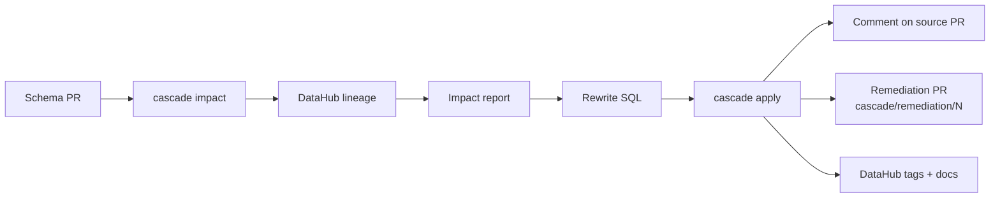
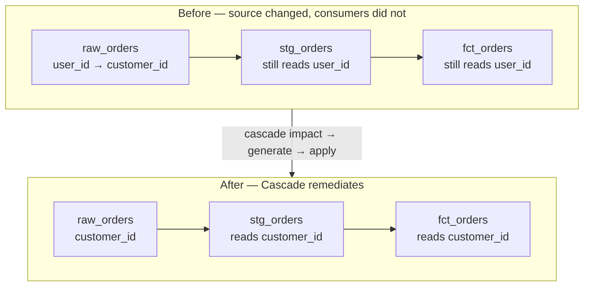
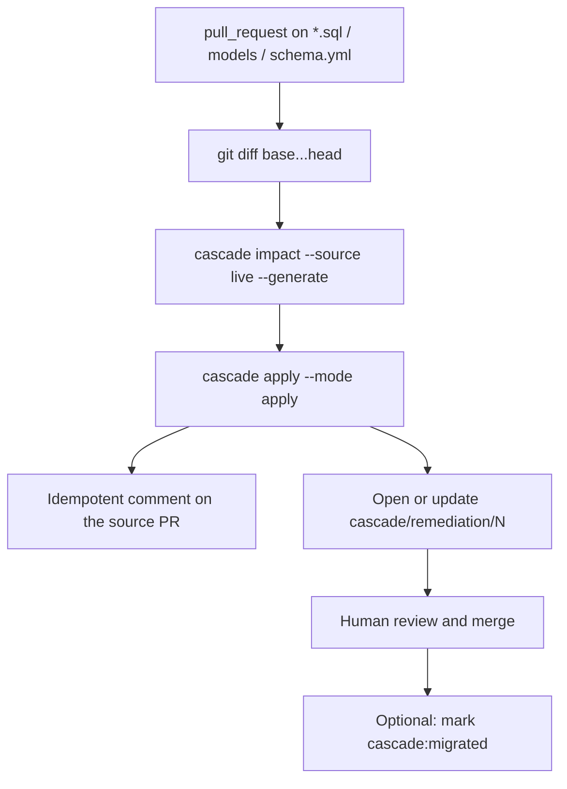

# Cascade

**A breaking schema PR becomes a coordinated migration.** Cascade reads [DataHub](https://datahubproject.io/) lineage, rewrites the downstream SQL, opens a remediation pull request, and writes the decision trail back to the graph.

It does not connect to your warehouse. It does not merge without a human. It coordinates the work that usually lives in Slack threads and stale tickets.

```text
pip install "cascade-agent @ git+https://github.com/himxsh/Cascade.git"
cascade init
```

Python 3.11+ · Apache-2.0 · GitHub Actions · DataHub Cloud or self-hosted GMS · SQL / dbt

---

## Why

Renaming `user_id` to `customer_id` on a raw table is a one-line PR. The blast radius is not. Downstream models, marts, and ML features still read the old name. Owners are scattered. The catalog is out of date the moment the source lands.

Cascade turns that into a repeatable loop: **impact → rewrite → reviewable PR → catalog write-back.**

## How it works




1. A pull request changes SQL, dbt models, or `schema.yml`.
2. Cascade maps the changed paths to DataHub URNs (`.cascade/config.json`).
3. It walks downstream lineage, owners, and ML features.
4. It rewrites affected SQL (deterministic rename, or LLM with a schema gate).
5. It comments the blast radius on the source PR and opens `cascade/remediation/<pr>`.
6. On merge, it can mark the source `cascade:migrated` in DataHub.

Dry-run is the default. Live GitHub and DataHub writes need explicit flags and secrets.

### Example: `user_id` → `customer_id`

A source PR renames a column on `raw_orders`. Downstream models still project `user_id`. Cascade walks lineage, rewrites those files, and opens one remediation PR.




The same loop is what the GitHub Action runs on every breaking SQL PR.

## What Cascade is and is not


| It is                                                        | It is not                                                   |
| ------------------------------------------------------------ | ----------------------------------------------------------- |
| A CLI + GitHub Action that uses **existing** DataHub lineage | A warehouse connector, ingest pipeline, or migration runner |
| A rewriter of **SQL / dbt files in git**                     | A Looker / Tableau / Spark / ORM fixer                      |
| Fail-closed on live GMS (`--source live`)                    | A hosted SaaS, or a replacement for the DataHub UI          |
| Dry-run by default; humans merge                             | An autonomous merge bot                                     |


Warehouses (Snowflake, Postgres, BigQuery, …) work insofar as DataHub already has schema + lineage for those tables. The URN’s `dataPlatform` is a string; Cascade never takes a database password.

## Install

```bash
pip install "cascade-agent @ git+https://github.com/himxsh/Cascade.git"
cascade --help
```

From a clone of this repo (development):

```bash
pip install -e .
```

Optional extras: `[writeback]` (DataHub ingest SDK), `[ui]` (local playground API).

Pin a git tag or commit in CI. Do not float `main` in production workflows.

## Quick start (offline)

No DataHub, no GitHub token. Uses the bundled fixture catalog.

```bash
pip install -e .
cascade demo --out artifacts/demo
```

Inspect:


| Artifact                                      | What it is                               |
| --------------------------------------------- | ---------------------------------------- |
| `artifacts/demo/apply/pr_comment.md`          | Blast radius + rationale                 |
| `artifacts/demo/apply/downstream_pr.diff`     | Rewritten SQL patch                      |
| `artifacts/demo/apply/datahub_writeback.json` | Planned catalog write-back (not applied) |


Stepwise, same fixture:

```bash
cascade impact \
  --urn 'urn:li:dataset:(urn:li:dataPlatform:snowflake,analytics.raw_orders,PROD)' \
  --diff examples/diffs/raw_orders_rename_user_id.json \
  --generate --models-dir examples/models --out /tmp/cascade-out

cascade apply --report /tmp/cascade-out/impact_report.json --out /tmp/cascade-apply
```

`--diff` is a JSON changes file or a unified diff (`.patch` / `.sql.diff`). JSON is detected by a leading `{` or `[`; everything else is parsed as a diff.

Tests: `python -m unittest discover -s tests -v`

## Use it on your repo

You need:

1. A GitHub repo with SQL / dbt (`*.sql`, `models/`, `schema.yml`).
2. Those tables already in DataHub with schema and **downstream lineage**.
3. Python 3.11+ in CI.

Then:

```bash
cascade init
cascade doctor
```

`init` writes `.cascade/config.json`, `.env.example`, and `.github/workflows/cascade.yml`. Fill the config with your URNs, copy `.env.example` → `.env` (never commit `.env`), and add the same DataHub keys as GitHub Actions secrets.

### Map paths to URNs

```json
{
  "models_dir": "models",
  "default_urn": "urn:li:dataset:(urn:li:dataPlatform:postgres,shop.public.raw_orders,PROD)",
  "mappings": [
    {
      "path": "models/",
      "urn": "urn:li:dataset:(urn:li:dataPlatform:postgres,shop.public.raw_orders,PROD)"
    }
  ],
  "urn_files": {},
  "rewrite": {
    "mode": "deterministic",
    "provider": "openai",
    "model": ""
  }
}
```

Longest matching path prefix wins. Override with `--urn` or `CASCADE_SOURCE_URN`. Nested files can be pinned in `urn_files`.

Copy-paste Action (fail-closed, live GMS only): `[examples/github-action/](examples/github-action/)`.

### GitHub Action

On a pull request that touches SQL / models / schema:




Required secret: `DATAHUB_GMS_URL` (HTTPS — Actions cannot see `localhost`). Optional: `DATAHUB_TOKEN`, `LLM_API_KEY`, `CASCADE_WRITEBACK`.

This repo’s own workflows also keep an offline **fixture-ci** job. Consumer templates do not: they fail if GMS is missing.

On merge of `cascade/remediation/*`, `[.github/workflows/cascade-migrated.yml](.github/workflows/cascade-migrated.yml)` can call `mark_migrated`.

## CLI


| Command                                 | Purpose                                                     |
| --------------------------------------- | ----------------------------------------------------------- |
| `cascade init`                          | Write config, `.env.example`, and the Action template       |
| `cascade doctor`                        | Check Python, config, URN mapping, GMS health, rewrite mode |
| `cascade demo`                          | Fixture path: impact → generate → apply dry-run             |
| `cascade impact --diff …`               | Blast-radius `ImpactReport` (JSON on stdout)                |
| `cascade impact … --generate --out DIR` | Impact + rewritten SQL                                      |
| `cascade generate --report … --out DIR` | Remediations from an existing report                        |
| `cascade apply --report … --out DIR`    | Artifacts; live GitHub/DataHub only with `--mode apply`     |
| `cascade policy --report …`             | High severity requires an open remediation PR               |


`--source`:


| Value                   | Behavior                                            |
| ----------------------- | --------------------------------------------------- |
| `fixture` (CLI default) | Bundled demo graph — offline                        |
| `live`                  | DataHub GMS (`DATAHUB_GMS_URL`); fails if unhealthy |
| `auto`                  | Live first, fixture fallback with a stderr notice   |


Live mode hydrates datasets, lineage, and owners from GMS GraphQL. Consumer CI should use `live`, not `auto`.

## Rewrite modes

`CASCADE_MODE=deterministic` (default) or `llm`. CLI: `--rewrite deterministic|llm`. Env wins over `.cascade/config.json`.


| Mode            | Behavior                                                                                                                                                                                                                                       |
| --------------- | ---------------------------------------------------------------------------------------------------------------------------------------------------------------------------------------------------------------------------------------------- |
| `deterministic` | Word-boundary column rename + schema gate. No LLM network.                                                                                                                                                                                     |
| `llm`           | One chat call per downstream node (OpenAI-compatible HTTP). Requires `LLM_API_KEY` (or `OPENAI_API_KEY`) and `LLM_MODEL`. Schema gate still rejects invented columns. Timeout / parse / gate failure falls back to deterministic and logs why. |


Providers (`CASCADE_LLM_PROVIDER`): `openai`, `anthropic`, `azure-openai`, `bedrock`, `ollama`, `custom` (`custom` requires `LLM_BASE_URL`).

A key in the environment does **not** turn LLM on. Mode must be `llm`.

## Environment


| Variable                                                   | When                                         |
| ---------------------------------------------------------- | -------------------------------------------- |
| `DATAHUB_GMS_URL` / `DATAHUB_TOKEN`                        | `--source live` and live write-back          |
| `CASCADE_SOURCE_URN`                                       | URN when path mapping misses                 |
| `CASCADE_MODE`                                             | `deterministic` (default) or `llm`           |
| `CASCADE_LLM_PROVIDER` / `LLM_MODEL` / `LLM_BASE_URL`      | LLM path                                     |
| `LLM_API_KEY` or `OPENAI_API_KEY`                          | LLM path                                     |
| `CASCADE_WRITEBACK=1`                                      | Live DataHub/ML tags (never on untrusted CI) |
| `GITHUB_TOKEN` / `GITHUB_REPOSITORY` / `CASCADE_PR_NUMBER` | Live PR comment (Action sets these)          |
| `CASCADE_OPEN_DOWNSTREAM_PR=1`                             | Create/update `cascade/remediation/{n}`      |


See `.env.example`. Actions secrets override `.env`. There are no warehouse credentials in this contract.

## Production behavior


| Concern        | Behavior                                                                                                                   |
| -------------- | -------------------------------------------------------------------------------------------------------------------------- |
| Modes          | `apply --mode dry-run` (default) writes artifacts only; `--mode apply` allows live GitHub/DataHub when secrets are set     |
| Policy         | `severity=high` requires an open remediation PR (`--require-policy` / `cascade policy --require`)                          |
| Comments       | Re-runs **edit** the existing `## Cascade impact report` comment                                                           |
| Remediation PR | Same upstream PR → same branch `cascade/remediation/{n}`                                                                   |
| Audit          | Receipts under `cascade/runs/<id>/` (gitignored)                                                                           |
| Failures       | No GMS on consumer CI → fail; no `CASCADE_OPEN_DOWNSTREAM_PR` → patch artifacts only; LLM failure → deterministic fallback |


Dialect-specific quoting (BigQuery backticks, Snowflake `QUALIFY`, mixed-case Postgres identifiers) is not modeled yet. Plain `user_id` → `customer_id` in vanilla dbt SQL is the supported case.

## DataHub skill

Draft skill `[breaking-change-remediation](oss/datahub-skills/skills/breaking-change-remediation/SKILL.md)` lives under `[oss/datahub-skills/](oss/datahub-skills/)`. In-repo until an upstream contribution to `[datahub-project/datahub-skills](https://github.com/datahub-project/datahub-skills)` is coordinated.

## Optional local UI

Paste a schema diff, run the fixture path, inspect blast radius and SQL diffs:

```bash
pip install -e ".[ui]"
uvicorn api.server:app --reload --port 8000
# in another terminal:
cd frontend && npm install && npm run dev
```

[http://localhost:5173](http://localhost:5173) → **Load demo diff** → **Run Cascade**.

## Limitations

- No lineage in DataHub means no blast radius. Cascade will not invent the graph.
- When DataHub has column-level lineage, blast radius is the datasets that consume the changed columns. Missing column lineage falls back to table-level — never “no impact.”
- Downstream in another GitHub repository is out of scope.
- Non-SQL consumers are out of scope.

## Contributing

See [CONTRIBUTING.md](CONTRIBUTING.md). Issues and pull requests are welcome.

```bash
pip install -e ".[dev]"
python -m unittest discover -s tests -v
```

## License

Apache License 2.0. See [LICENSE](LICENSE). Copyright 2026 Cascade contributors.