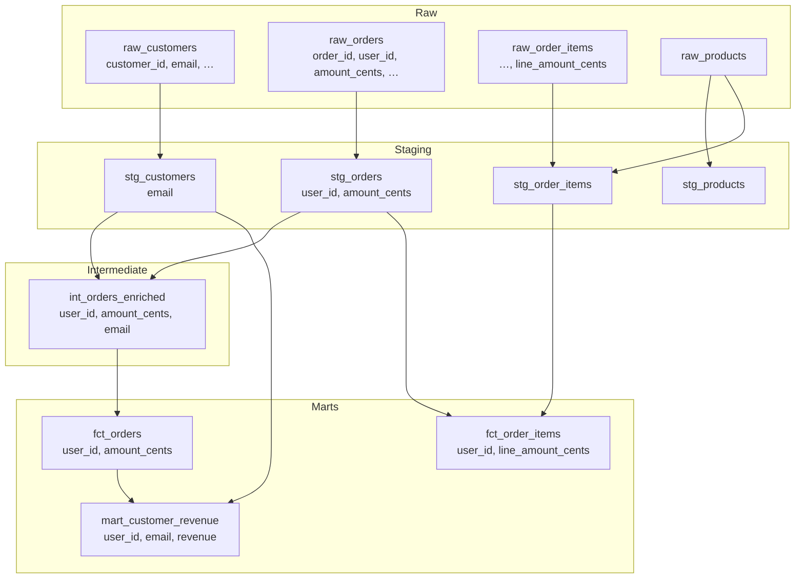
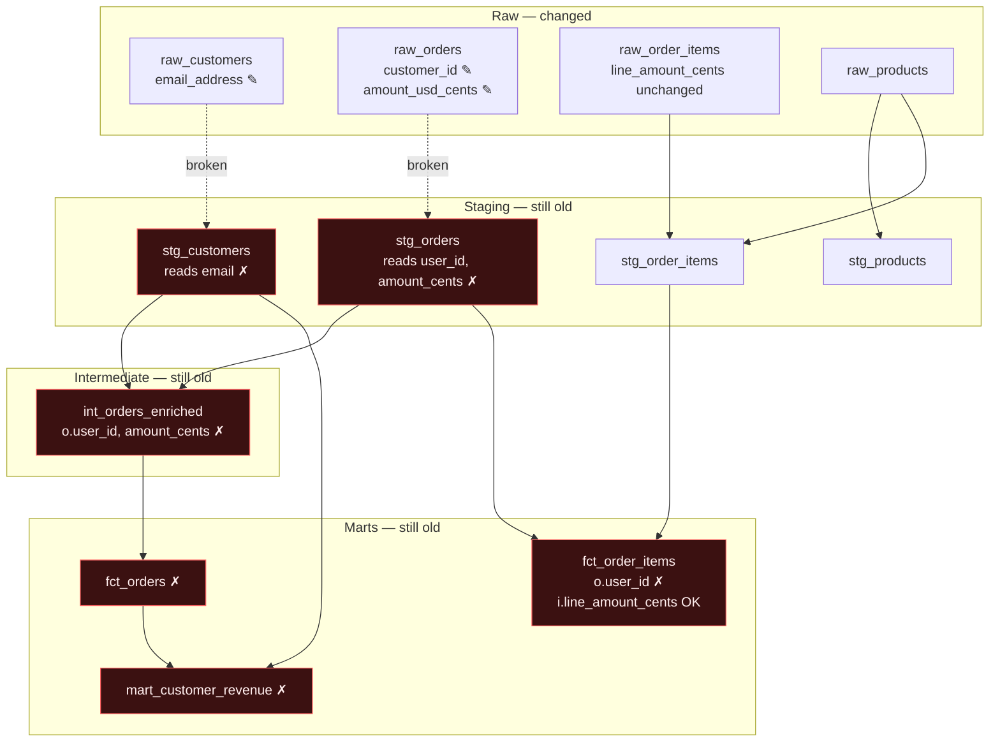
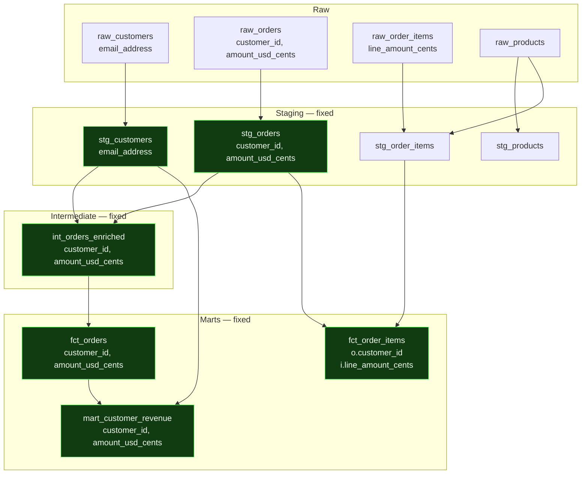
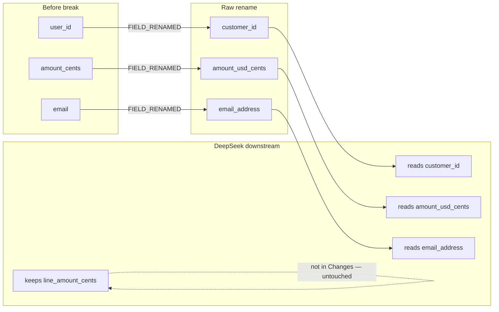

# Cascade shop stress-test dataflow

Demo break: multi-source rename on `raw_orders` + `raw_customers`, remediated by **DeepSeek v3.2**.

## 1. Original data flow (healthy)

Lineage as ingested into DataHub. Key columns shown on the break-relevant path.

## 2. After the breaking change (before Cascade)

PR-style renames on raw only:

| Source | Renames |
|--------|---------|
| `raw_orders` | `user_id` → `customer_id`, `amount_cents` → `amount_usd_cents` |
| `raw_customers` | `email` → `email_address` |

Downstream SQL still reads the **old** names → broken edges (red).

Blast radius Cascade saw (live DataHub):  
`stg_orders`, `stg_customers`, `int_orders_enriched`, `fct_orders`, `fct_order_items`, `mart_customer_revenue`.

## 3. Final flow after DeepSeek fix

Cascade + DeepSeek rewrote the six downstream models. New upstream names are read; `line_amount_cents` on items is left alone.

### Column mapping (stress-test path)

Artifacts from the demo run: `/tmp/cascade-gate-deepseek-v3-2-apply/` (`downstream_pr.diff`, `rewritten/*.sql`).
